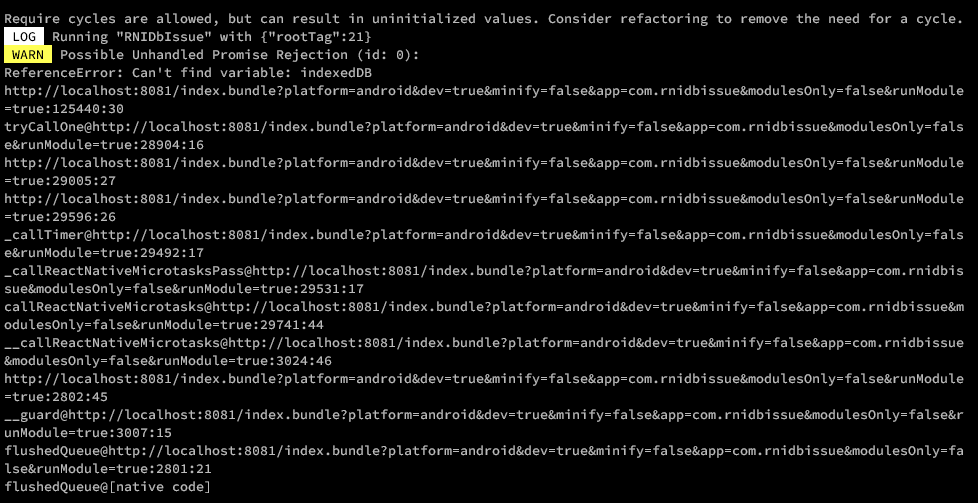

## React Native Indexed DB Issue

**Uses**: React Native, Parse Platform JS SDK, and Async Storage (@react-native-async-storage/async-storage)

**Issue**: "Possible Unhandled Promise Rejection (id: 0):
ReferenceError: Can't find variable: indexedDB"

**Steps to run:**
1. Clone the repository
2. cd into repository and initialize `yarn`
3. Run on android emulator/adb connected device.
`yarn android`

Thank You 🙏
